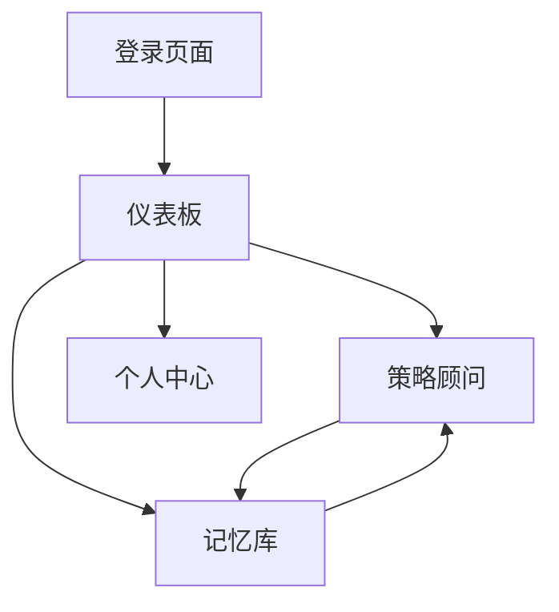

## 1. 产品概述

"来事儿"是一款AI职场策略助手应用，帮助用户应对复杂的职场环境。通过智能分析用户的工作情况，提供个性化的职场策略建议，帮助用户在职场中游刃有余。

目标用户：职场新人、中层管理者、需要提升职场情商的专业人士。核心价值：通过AI智能分析，为用户提供量身定制的职场策略，提升职场竞争力。

## 2. 核心功能

### 2.1 用户角色

| 角色   | 注册方式  | 核心权限           |
| ---- | ----- | -------------- |
| 普通用户 | 邮箱注册  | 查看基础策略、编辑个人情况  |
| 高级用户 | 邀请码升级 | 无限制访问所有策略、导出报告 |

### 2.2 功能模块

"来事儿"应用包含以下核心页面：

1. **仪表板页面**：展示用户当前职场状况概览，包括等级、老板风格、阶段等关键信息。
2. **策略顾问页面**：提供AI策略生成功能，用户输入事实后获得针对性建议。
3. **记忆库页面**：矩阵风格的记忆管理界面，支持浏览、搜索和管理长期记忆。
4. **个人中心页面**：用户信息管理和设置。

### 2.3 页面详情

| 页面名称 | 模块名称   | 功能描述                      |
| ---- | ------ | ------------------------- |
| 仪表板  | 状况概览   | 显示用户当前职场等级、老板风格、所处阶段等关键指标 |
| 仪表板  | 快速编辑   | 支持快速修改个人职场状况参数            |
| 仪表板  | 策略预览   | 展示最近生成的策略摘要               |
| 策略顾问 | 事实输入   | 提供文本输入框让用户描述当前职场情况        |
| 策略顾问 | AI策略生成 | 基于输入生成老板版本、自我版本和提示建议      |
| 策略顾问 | 策略对比   | 并排展示不同版本的策略建议             |
| 记忆库  | 矩阵视图   | 以卡片网格形式展示所有记忆和洞察          |
| 记忆库  | 搜索过滤   | 支持关键词搜索和时间范围筛选            |
| 记忆库  | 记忆管理   | 允许编辑、删除和标记重要记忆            |
| 个人中心 | 用户信息   | 显示和编辑个人基本信息               |
| 个人中心 | 设置选项   | 主题切换、通知设置等个性化配置           |

## 3. 核心流程

### 用户主要操作流程：

1. **首次使用流程**：用户注册登录 → 完善个人职场信息 → 进入仪表板查看概览 → 使用策略顾问获得建议
2. **日常使用流程**：登录应用 → 查看仪表板 → 使用策略顾问输入新情况 → 查看生成的策略 → 将有价值的洞察保存到记忆库
3. **策略优化流程**：在记忆库中回顾历史 → 发现模式 → 回到策略顾问进行深度分析

## 4. 用户界面设计

### 4.1 设计风格

* **主色调**：深色系（#0a0a0a, #1a1a1a）配合霓虹蓝（#00d4ff）和霓虹紫（#8b5cf6）

* **按钮风格**：圆角矩形，带有发光效果，悬停时有颜色渐变动画

* **字体**：Inter 或 JetBrains Mono，标题 24-32px，正文 14-16px

* **布局风格**：卡片式布局，带有玻璃态效果（glassmorphism）

* **图标风格**：使用 Lucide React 图标库，线条风格，配合发光效果

### 4.2 页面设计概览

| 页面名称 | 模块名称 | UI元素                     |
| ---- | ---- | ------------------------ |
| 仪表板  | 状况概览 | 圆形进度条显示等级，卡片式信息展示，霓虹边框效果 |
| 仪表板  | 快速编辑 | 滑动条和下拉菜单，带有实时预览效果        |
| 策略顾问 | 事实输入 | 大文本输入框，带有字符计数和语法高亮       |
| 策略顾问 | 策略展示 | 分栏式布局，每个策略版本有独立的卡片容器     |
| 记忆库  | 矩阵视图 | 网格布局，每个记忆卡片有悬浮动画和霓虹边框    |
| 记忆库  | 搜索栏  | 顶部搜索栏，带有实时搜索建议和过滤选项      |

### 4.3 响应式设计

* **桌面优先**：主要面向桌面端用户，优化大屏幕体验

* **移动端适配**：支持平板和手机访问，采用响应式网格布局

* **触摸优化**：按钮和交互元素适合触摸操作，支持手势滑动

### 4.4 动画效果

* **页面切换**：使用 Framer Motion 实现平滑的页面过渡动画

* **元素出现**：卡片和按钮采用渐显和上移动画

* **悬停效果**：鼠标悬停时元素发光和缩放

* **加载动画**：使用脉冲效果和骨架屏提升等待体验

